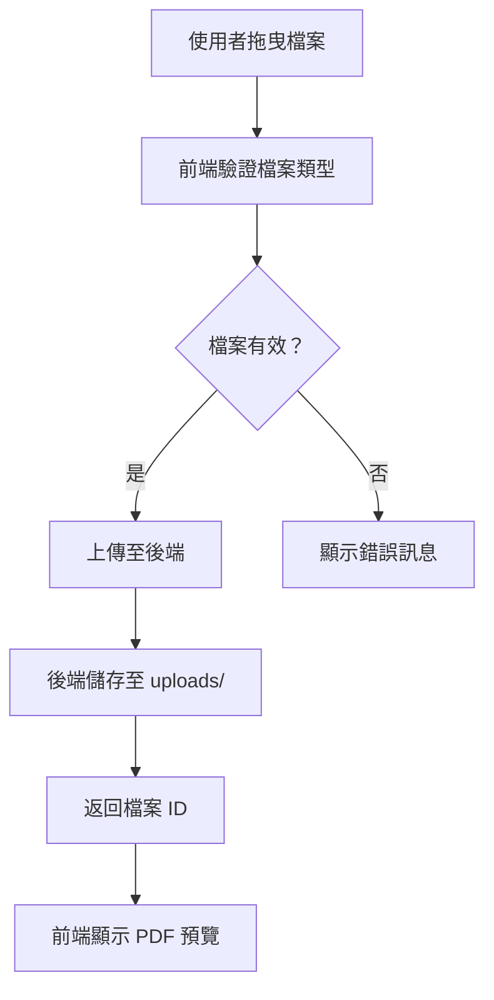
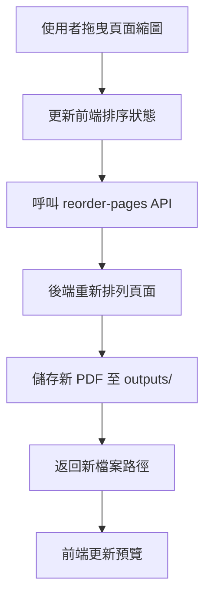
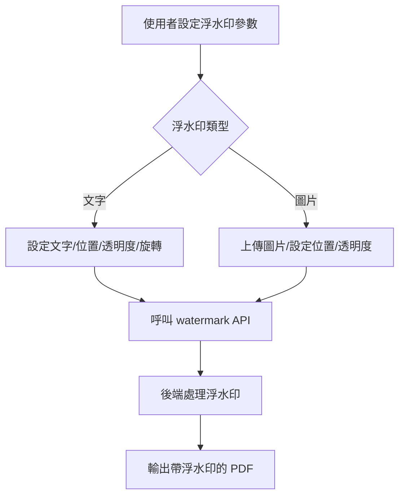
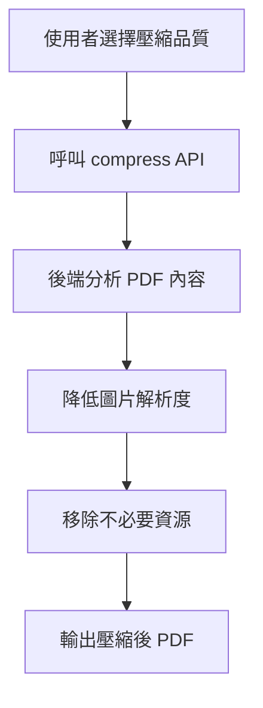

# PDF 編輯器 - 技術架構文件

## 專案概述

這是一個基於 React + FastAPI 的網頁版 PDF 編輯器，提供頁面管理、尺寸調整、壓縮、浮水印和格式轉換等功能。

## 技術棧

### 前端
- **React 18** - UI 框架
- **TypeScript** - 類型安全
- **Material-UI (MUI)** - UI 元件庫
- **react-beautiful-dnd** - 拖曳排序功能
- **axios** - HTTP 客戶端
- **react-dropzone** - 檔案拖曳上傳

### 後端
- **FastAPI** - Python Web 框架
- **PyPDF2 / pypdf** - PDF 讀取與操作
- **Pillow (PIL)** - 圖片處理
- **pdf2image** - PDF 轉圖片
- **python-magic** - 檔案類型檢測
- **uvicorn** - ASGI 伺服器

## 專案結構

```
PDF-editor/
├── .venv/                    # Python 虛擬環境
├── backend/                  # FastAPI 後端
│   ├── app/
│   │   ├── __init__.py
│   │   ├── main.py          # FastAPI 應用入口
│   │   ├── config.py        # 配置設定
│   │   ├── models/          # Pydantic 模型
│   │   │   ├── __init__.py
│   │   │   └── schemas.py   # API 請求/回應模型
│   │   ├── routers/         # API 路由
│   │   │   ├── __init__.py
│   │   │   ├── pdf.py       # PDF 處理路由
│   │   │   └── convert.py   # 格式轉換路由
│   │   ├── services/        # 業務邏輯
│   │   │   ├── __init__.py
│   │   │   ├── pdf_service.py
│   │   │   ├── compress_service.py
│   │   │   ├── watermark_service.py
│   │   │   └── convert_service.py
│   │   └── utils/           # 工具函數
│   │       ├── __init__.py
│   │       └── pdf_utils.py
│   ├── uploads/             # 上傳檔案暫存
│   ├── outputs/             # 輸出檔案
│   ├── requirements.txt     # Python 依賴
│   └── .env                 # 環境變數
├── frontend/                # React 前端
│   ├── public/
│   ├── src/
│   │   ├── components/      # React 元件
│   │   │   ├── FileUpload.tsx
│   │   │   ├── PDFPreview.tsx
│   │   │   ├── PageThumbnail.tsx
│   │   │   ├── PageReorder.tsx
│   │   │   ├── SizeSelector.tsx
│   │   │   ├── Compressor.tsx
│   │   │   ├── Watermark.tsx
│   │   │   └── Converter.tsx
│   │   ├── hooks/           # Custom Hooks
│   │   │   ├── usePDF.ts
│   │   │   └── useDragDrop.ts
│   │   ├── services/        # API 服務
│   │   │   └── api.ts
│   │   ├── types/           # TypeScript 類型
│   │   │   └── index.ts
│   │   ├── App.tsx
│   │   ├── App.css
│   │   └── main.tsx
│   ├── package.json
│   ├── tsconfig.json
│   └── vite.config.ts
├── .gitignore
├── README.md
└── plans/                   # 計畫文件
    └── architecture.md
```

## API 設計

### 基礎路徑：`/api`

#### PDF 處理

| 方法 | 路徑 | 描述 |
|------|------|------|
| POST | `/api/upload` | 上傳 PDF 檔案 |
| POST | `/api/pdf/delete-pages` | 刪除指定頁面 |
| POST | `/api/pdf/reorder-pages` | 重新排序頁面 |
| POST | `/api/pdf/resize` | 調整頁面尺寸 |
| POST | `/api/pdf/compress` | 壓縮 PDF |
| POST | `/api/pdf/watermark/text` | 添加文字浮水印 |
| POST | `/api/pdf/watermark/image` | 添加圖片浮水印 |

#### 格式轉換

| 方法 | 路徑 | 描述 |
|------|------|------|
| POST | `/api/convert/to-image` | PDF 轉 JPG/PNG |
| GET | `/api/download/:filename` | 下載處理後的檔案 |

### 常用紙張尺寸

| 尺寸 | 寬度 (mm) | 高度 (mm) | 寬度 (pt) | 高度 (pt) |
|------|-----------|-----------|-----------|-----------|
| A3 | 297 | 420 | 842 | 1191 |
| A4 | 210 | 297 | 595 | 842 |
| A5 | 148 | 210 | 420 | 595 |
| B2 | 500 | 707 | 1417 | 2004 |
| B3 | 353 | 500 | 1000 | 1417 |
| B4 | 250 | 353 | 709 | 1000 |
| B5 | 176 | 250 | 500 | 709 |
| Letter | 216 | 279 | 612 | 792 |
| Legal | 216 | 356 | 612 | 1008 |

## 核心功能流程

### 1. 檔案上傳流程



### 2. 頁面排序流程



### 3. 浮水印添加流程



### 4. PDF 壓縮流程



## 資料模型

### PDF 檔案模型

```typescript
interface PDFFile {
  id: string;
  name: string;
  size: number;
  pageCount: number;
  pages: Page[];
  uploadedAt: Date;
}

interface Page {
  id: string;
  pageNumber: number;
  thumbnailUrl: string;
  width: number;
  height: number;
}
```

### 浮水印配置模型

```typescript
interface WatermarkConfig {
  type: 'text' | 'image';
  position: 'center' | 'top-left' | 'top-right' | 'bottom-left' | 'bottom-right';
  opacity: number;
  rotation: number;
  
  // 文字浮水印專用
  text?: string;
  fontSize?: number;
  fontFamily?: string;
  color?: string;
  
  // 圖片浮水印專用
  imageUrl?: string;
  imageWidth?: number;
}
```

## 安全性考量

1. **檔案上傳限制**
   - 限制檔案大小（預設 50MB）
   - 驗證檔案類型（僅允許 PDF）
   - 隨機化儲存路徑

2. **資源管理**
   - 定期清理暫存檔案
   - 設定檔案保留期限（24 小時）

3. **API 保護**
   - 輸入驗證
   - 錯誤處理
   - 速率限制（可選）

## 開發環境設定

### Python 虛擬環境

```bash
python -m venv .venv
source .venv/bin/activate  # Windows: .venv\Scripts\activate
pip install -r backend/requirements.txt
```

### 前端環境

```bash
cd frontend
npm install
npm run dev
```

### 後端環境

```bash
cd backend
uvicorn app.main:app --reload --host 0.0.0.0 --port 8000
```

## Git 版本控制策略

1. **初始提交**
   - 專案結構
   - .gitignore
   - README.md

2. **功能提交**
   - 每個主要功能獨立提交
   - 清晰的提交訊息

3. **提交訊息格式**
   ```
   feat: 新增功能描述
   fix: 修復問題描述
   docs: 文件更新描述
   refactor: 程式碼重構描述
   test: 測試相關描述
   ```
