# PDF 編輯器 - 系統架構圖

## 整體系統架構

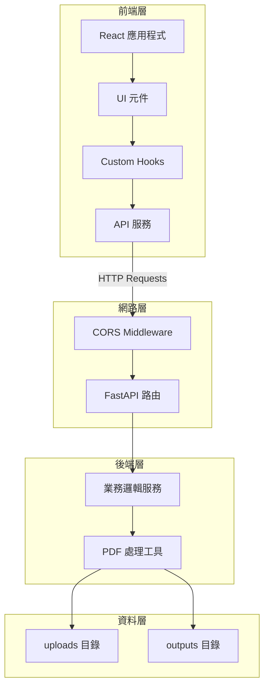

## 前端元件架構

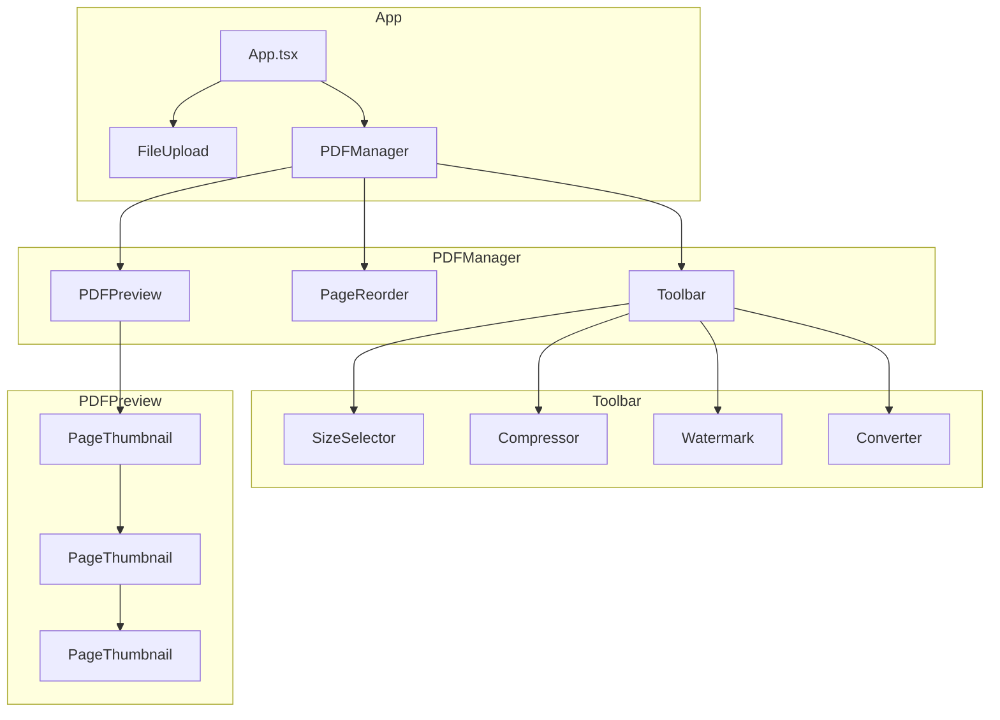

## API 路由架構

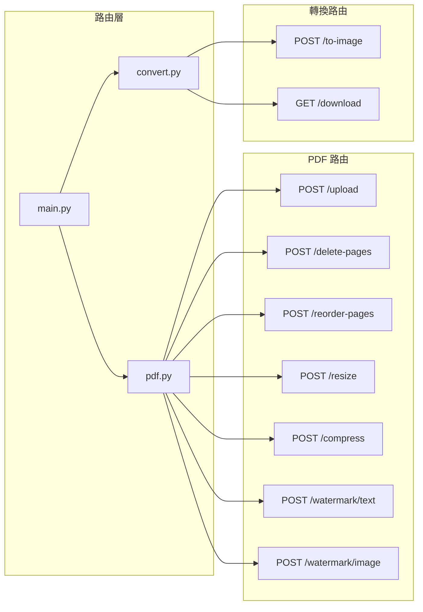

## 服務層架構

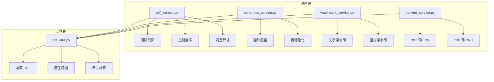

## 資料流程 - 檔案上傳與處理

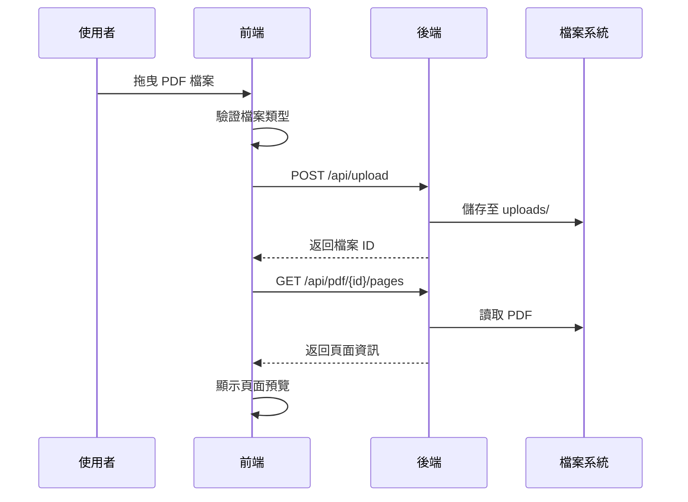

## 資料流程 - 頁面重新排序

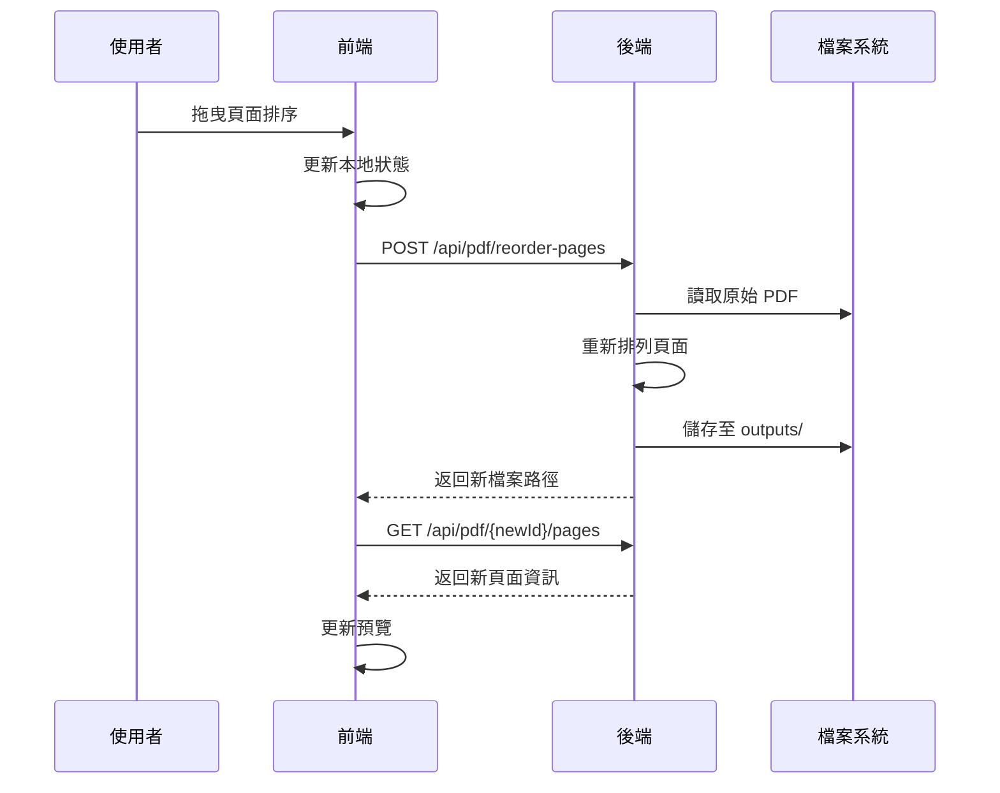

## 資料流程 - 浮水印添加

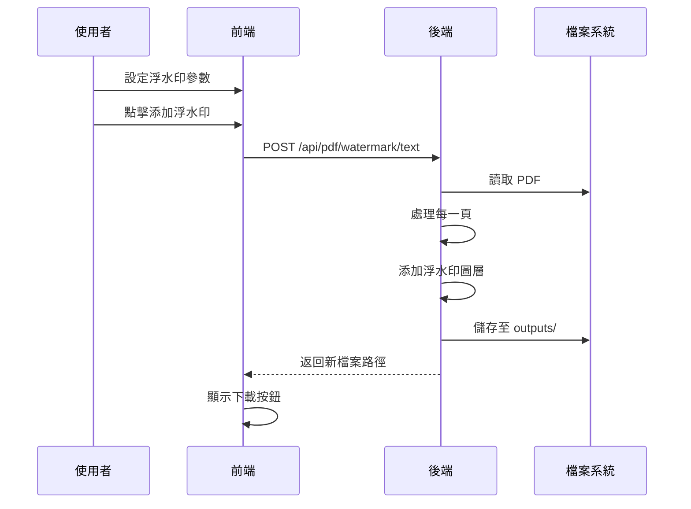

## 資料流程 - PDF 壓縮

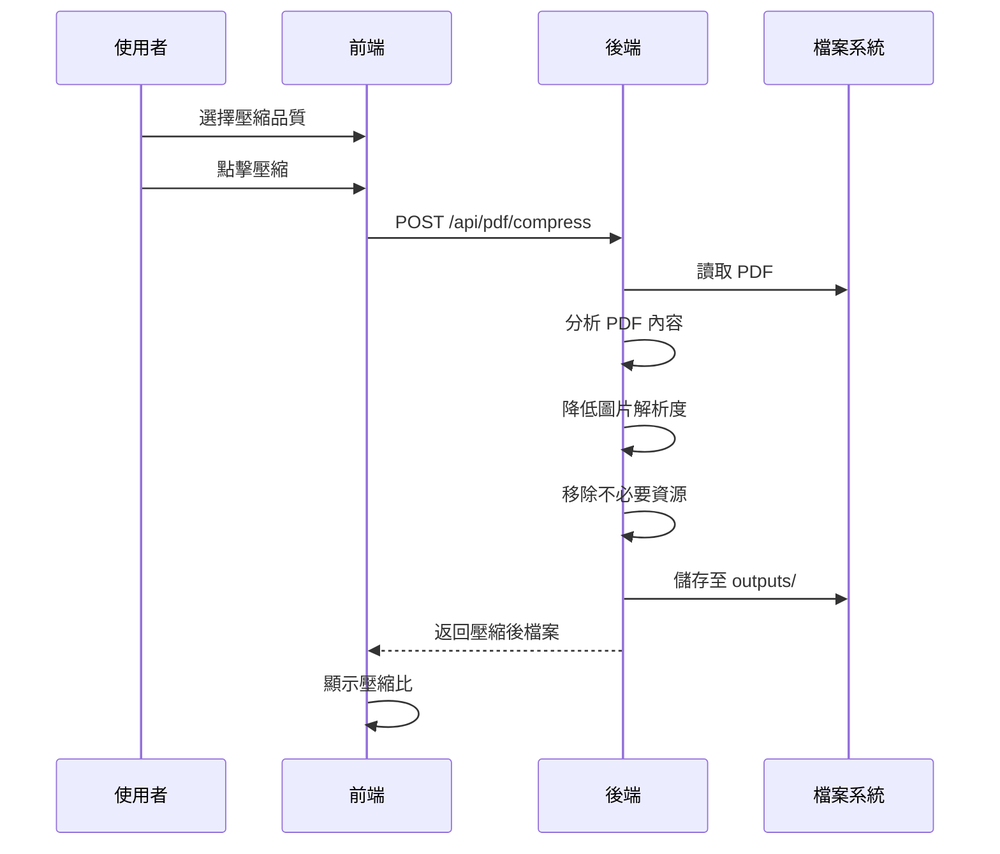

## 資料流程 - PDF 轉圖片

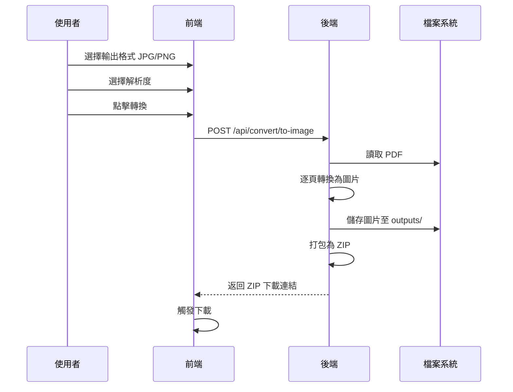

## 狀態管理架構

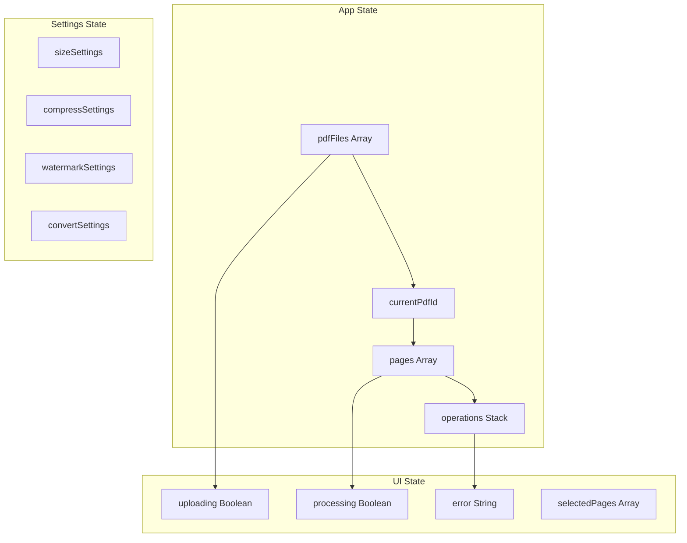

## 常用紙張尺寸參考

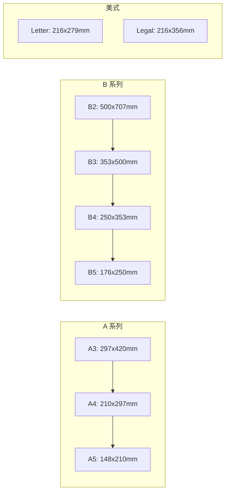

## 安全性架構

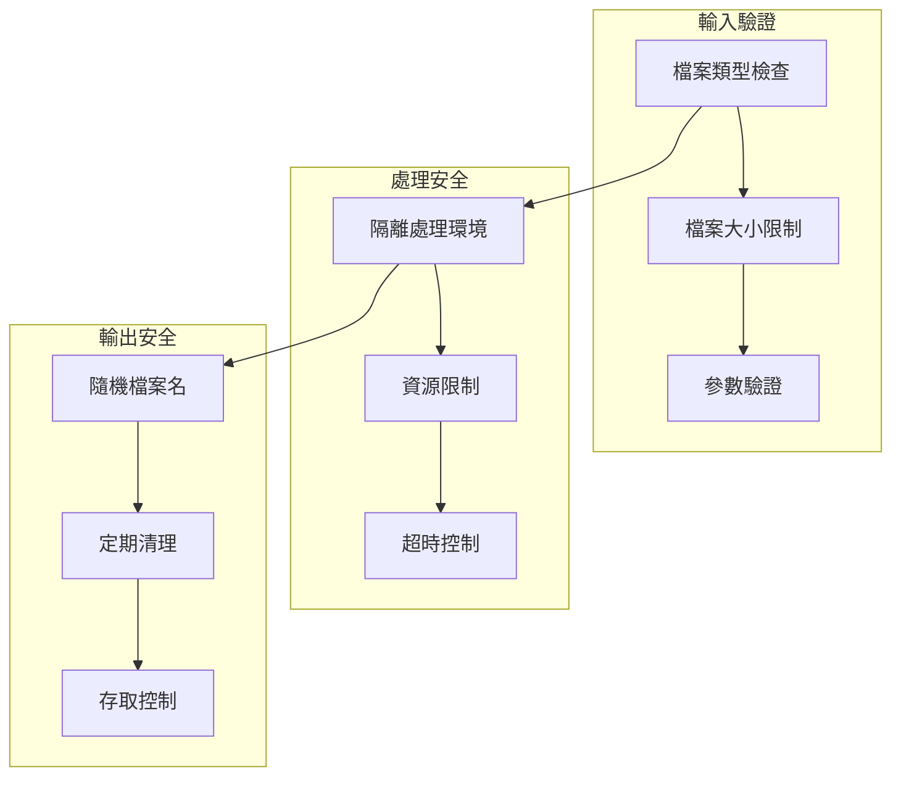
